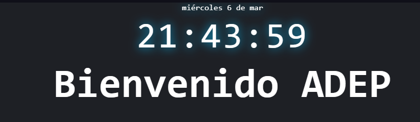

# Aplicacion ToDo

    La aplicación consta de un TO DO, es decir, una herramienta para organizar tareas por cumplir, marcarlas como cumplidas y eliminarlas, para generar una mejor interacción con el usuario y un mayor sentido de personalización se agregó una sección para colocar un nombre de usuario, posteriormente una sección de carga de la aplicación que genera una sensación de mas solidez en la misma y finalmente el panel interactivo de la aplicación. 

    Al panel de aplicación se le agrego una nueva herramienta la cual consiste en un cronometro para establecer una estrategia POMODORO para llevar a cabo de manera mas sencilla todas las tareas declaradas por el usuario.

    La aplicación fue realizada usando JavaScript, HTML y CSS. Para JavaScript la aplicación fue dividida en secciones en pro de tratar de implementar buenas prácticas de programación de la siguiente manera:

## Panel inicial

  

    Panel donde el usuario puede ingreasr su nombre o alias para interactuar con la aplicacion

## Panel de Transicion

  

    Panel de carga mientras se renderiza la aplicacion

## Panel de la aplicacion

Compuesto de dos secciones, una primera sección titulada panel superior y una segunda sección titulada APP

### Seccion Panel superior

  

Seccion en la que se despliega el saludo al usuario, la hora y la fecha actual

### Seccion APP

  

Seccion en la que se encuentran el panel de listas de tareas y el panel de pomodoro

## Despliegue de aplicacion:

https://adep-123.github.io/ToDo/
